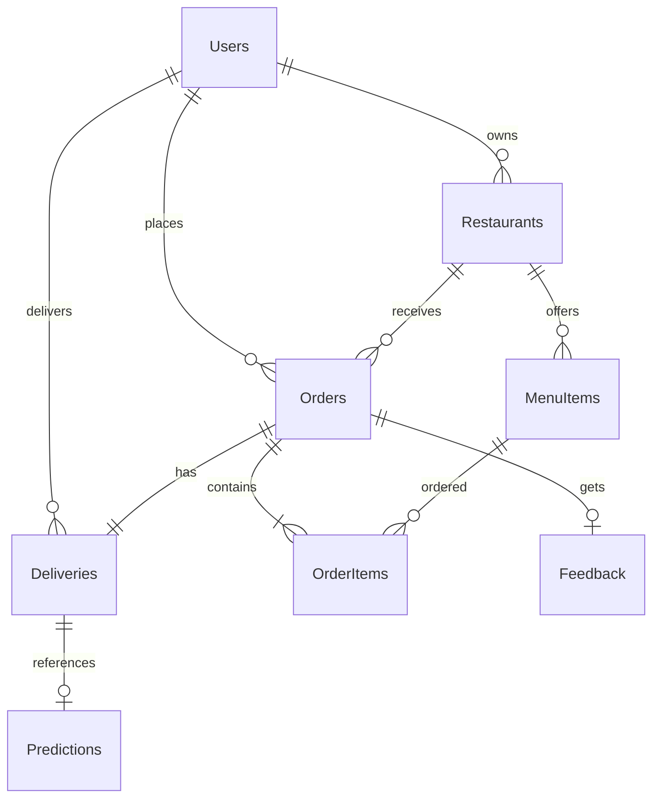

# Craveo: Food Ordering System & Delivery Time Estimation Engine
## Project Design, System Architecture & Roadmap

This document outlines the complete architectural design, folder structure, database schema, and phased execution plan for building Craveo, the AI-powered Food Ordering System with Delivery Time Estimation.

---

## 1. System Architecture

The application is built using a modern decoupled-monolith architecture with:
1. **Frontend**: Responsive multi-role dashboards (Customer, Restaurant, Admin) utilizing HTML5, CSS3, Bootstrap 5, and vanilla JavaScript.
2. **Backend**: Python-based Django REST Framework web application serving as the API and MVC controller.
3. **Database**: MySQL relational database storing structured tables with appropriate indexing.
4. **Machine Learning Engine**: Offline model training pipeline that outputs a serialized prediction model loaded dynamically by Django's delivery service.

```mermaid
graph TD
    subgraph Client Layer
        Customer[Customer Client]
        RestOwner[Restaurant Owner Client]
        Admin[Administrator Dashboard]
    end

    subgraph Application Layer (Django)
        Router[Django URL Router]
        Views[Django MVC Views / API Endpoints]
        Models[Django ORM Models]
        MLService[ML Prediction Service]
    end

    subgraph Machine Learning Layer
        RawData[Kaggle Dataset / Synthetic Data]
        TrainScript[Model Training Pipeline]
        ModelPKL[delivery_model.pkl]
    end

    subgraph Data Layer
        MySQL[(MySQL Database)]
    end

    %% Client and App connections
    Customer -->|HTTP/REST| Router
    RestOwner -->|HTTP/REST| Router
    Admin -->|HTTP/REST| Router
    
    Router --> Views
    Views --> Models
    Views --> MLService
    
    %% ML connections
    RawData --> TrainScript
    TrainScript -->|Saves| ModelPKL
    MLService -->|Loads| ModelPKL
    
    %% DB connections
    Models -->|Reads/Writes| MySQL
    MLService -->|Saves Prediction| MySQL
```

---

## 2. Database Design & SQL Schema

We will use a MySQL database named `food_delivery_db` with the following 8 tables.

### Database Tables & ER Relationships
- **Users**: Extended custom user model with roles (`customer`, `restaurant_owner`, `delivery_driver`, `admin`).
- **Restaurants**: Store details, location (lat/long), and owner reference.
- **MenuItems**: Menu items linked to a restaurant and food categories.
- **Orders**: Core order record with order statuses (`Pending`, `Preparing`, `Out for Delivery`, `Delivered`, `Cancelled`).
- **OrderItems**: Many-to-many relationship table between Orders and MenuItems.
- **Deliveries**: Tracking details, assigned driver, starting status, and actual delivery times.
- **Predictions**: Predicted delivery times, feature inputs used, and target accuracy metrics.
- **Feedback**: Customer ratings and comments on delivery and food quality.



---

## 3. Machine Learning Architecture

The Delivery Time Estimation Engine is responsible for predicting the delivery time in minutes using regression models.

### Data Features
- **Features**: Distance (km), Preparation Time (mins), Traffic Level (Low, Medium, High), Order Volume (count), Hour of Day, Day of Week, Peak Hours (binary), Restaurant Load (Active Orders).
- **Target**: `actual_delivery_time` (minutes).

### ML Pipeline Structure
1. **Preprocessing**: Handling missing values, outlier detection using IQR, label encoding categorical variables, and standard scaling numerical features.
2. **Models**: Linear Regression, Random Forest Regressor, and XGBoost Regressor.
3. **Evaluation**: Compare Mean Absolute Error (MAE), Root Mean Squared Error (RMSE), and $R^2$ Score.
4. **Auto-Selection**: Selects the model with the highest $R^2$ Score or lowest MAE and saves it as `delivery_model.pkl` and the scaler as `scaler.pkl`.

---

## 4. Directory Structure

```
FoodOrderingAI/
├── FoodOrderingAI/         # Core Django settings
│   ├── __init__.py
│   ├── settings.py
│   ├── urls.py
│   ├── wsgi.py
│   └── asgi.py
├── users/                  # Custom users, registration, profiles
│   ├── __init__.py
│   ├── models.py
│   ├── views.py
│   ├── urls.py
│   └── tests.py
├── restaurants/            # Restaurant & Menu management
│   ├── __init__.py
│   ├── models.py
│   ├── views.py
│   ├── urls.py
│   └── tests.py
├── orders/                 # Cart, checkout, order placing
│   ├── __init__.py
│   ├── models.py
│   ├── views.py
│   ├── urls.py
│   └── tests.py
├── delivery/               # Delivery assignment, status, ETA engine
│   ├── __init__.py
│   ├── models.py
│   ├── views.py
│   ├── urls.py
│   └── tests.py
├── analytics/              # Dashboard charts, reports, Power BI export
│   ├── __init__.py
│   ├── models.py
│   ├── views.py
│   ├── urls.py
│   └── tests.py
├── ml_model/               # ML Pipeline code and saved artifacts
│   ├── train.py
│   ├── delivery_model.pkl
│   └── scaler.pkl
├── dataset/                # Raw, cleaned, and processed CSV datasets
│   ├── raw_data.csv
│   ├── cleaned_data.csv
│   └── processed_data.csv
├── db/                     # MySQL initialization scripts
│   └── schema.sql
├── templates/              # HTML layout templates
├── static/                 # CSS/JS files
├── requirements.txt
├── README.md
└── manage.py
```

---

## 5. Phased Implementation Roadmap

*   **Phase 1: Setup & Initialization** (Django project creation, configuration of MySQL backend connection, requirements installation).
*   **Phase 2: Dataset & Cleaning** (Gather/generate delivery dataset, clean and preprocess data into CSVs).
*   **Phase 3: Model Training** (Write ML pipeline script, train models, compare metrics, export best model to `ml_model/`).
*   **Phase 4: Database Design & Schema** (Run MySQL schema scripts, run Django migrations, customize models).
*   **Phase 5: Django Application Core Development** (Implement Users, Restaurants, Orders, and Delivery apps).
*   **Phase 6: AI Integration** (Connect order creation pipeline with ML estimator to save and display dynamic ETAs).
*   **Phase 7: Frontend Dashboards & Visualizations** (Implement Bootstrap templates, admin charts, and reports).
*   **Phase 8: Testing** (Add unittest suites for backend processes, Django endpoints, and ML predictions).
*   **Phase 9: Deployment** (Write setup instruction guides, export Power BI compatible reports and CSVs, document system usage).
